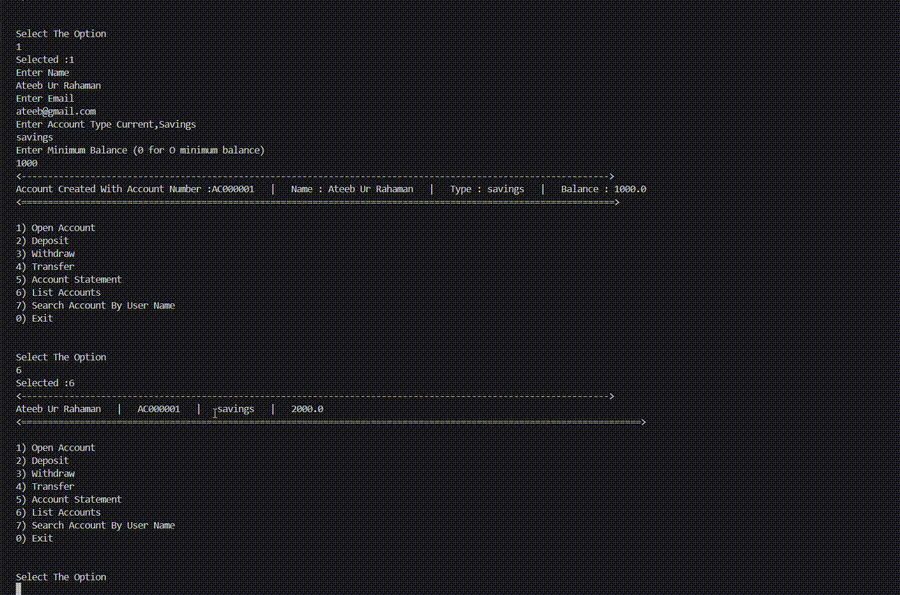
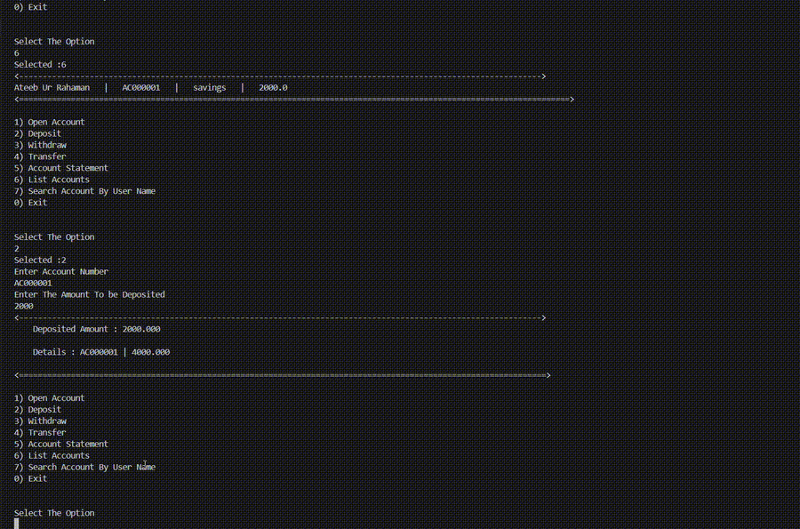
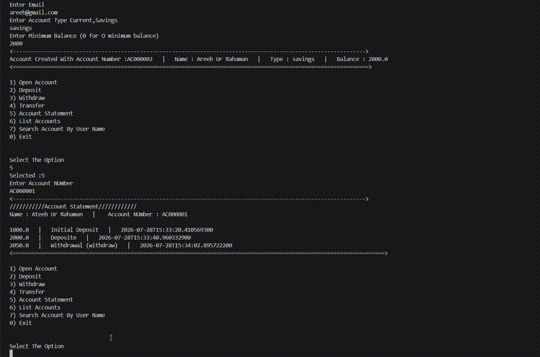
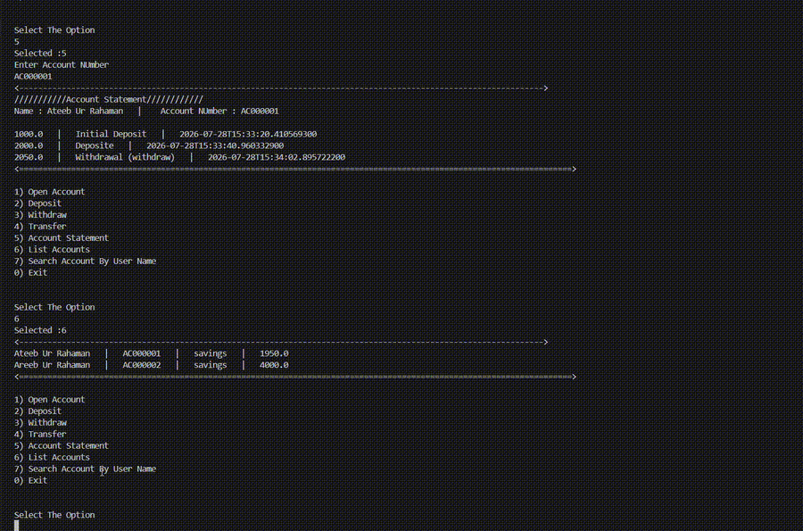
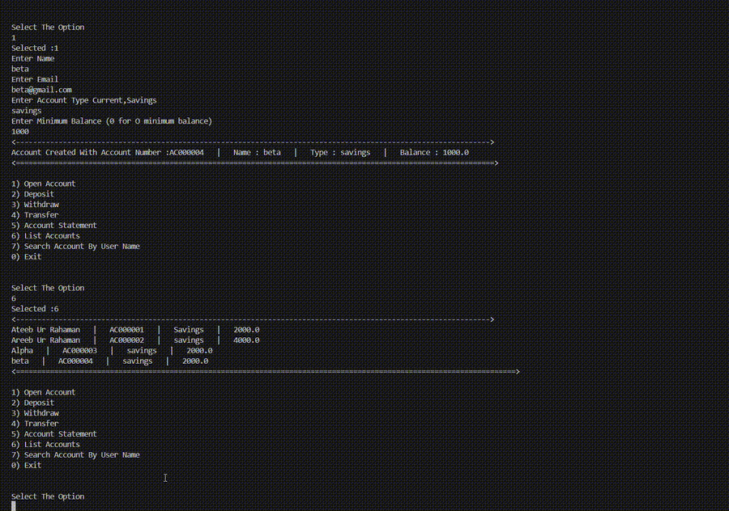
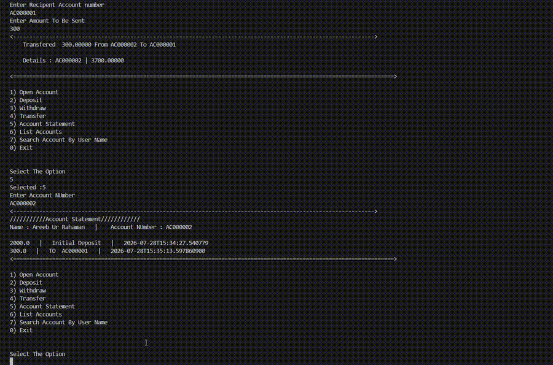
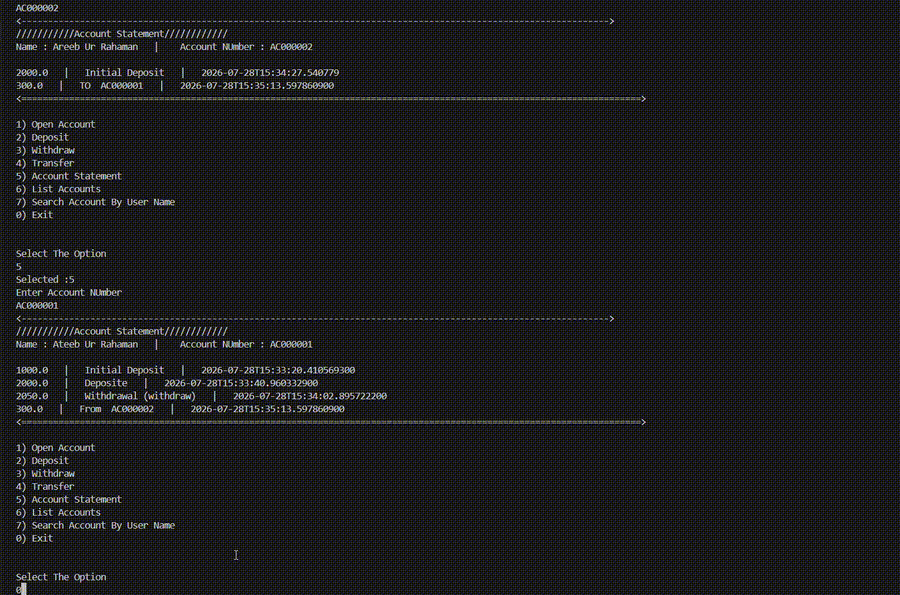

<div align="center">

# 🏦 ConsoleBank

### A Console-Based Banking Management System built with Core Java

A modular banking application demonstrating **Object-Oriented Programming**, **Java Collections**, **Streams API**, **Repository Pattern**, **Exception Handling**, and **Clean Architecture**.

<br>


</div>

---

# 📖 Table of Contents

- [About](#-about)
- [Architecture](#-architecture)
- [Features](#-features)
- [Project Demonstration](#-project-demonstration)
- [Technologies Used](#-technologies-used)
- [Java Concepts Demonstrated](#-java-concepts-demonstrated)
- [Project Structure](#-project-structure)
- [Getting Started](#-getting-started)
- [Future Enhancements](#-future-enhancements)
- [Author](#-author)

---

# 📚 About

ConsoleBank is a **Core Java Banking Management System** that simulates common banking operations through a console interface.

The project focuses on writing clean, modular, and maintainable Java code while applying software engineering principles such as layered architecture, repository abstraction, validation, and exception handling.

Users can create bank accounts, deposit and withdraw money, transfer funds, search customers, list accounts, and view account statements.

This project was built to strengthen Java backend fundamentals before moving to enterprise frameworks such as **Spring Boot**.

---

# 🏗 Architecture

```text
                   User
                     │
                     ▼
              Main.java (app)
                     │
                     ▼
          BankService Interface
                     │
                     ▼
          BankServiceImpl
                     │
        ┌────────────┼─────────────┐
        ▼            ▼             ▼
 Repository      Validation    Exceptions
        │
        ▼
 Domain Models (Account, Customer, Transaction)
```

The project follows a layered architecture where user requests are processed by the service layer, validated before execution, and stored using repository classes backed by Java Collections.

---

# ✨ Features

- 🏦 Create New Bank Account
- 💰 Deposit Money
- 💸 Withdraw Money
- 🔄 Transfer Money Between Accounts
- 🔍 Search Customer by Name
- 📋 Display All Accounts
- 📄 View Account Statement
- 🆔 Automatic Customer ID Generation using UUID
- 🔢 Automatic Account Number Generation
- 🛡 Custom Exception Handling
- ✅ Input Validation
- 📂 Repository-Based Data Management
- 🧩 Modular Package Structure

---

# 🎥 Project Demonstration

## 🆕 Create Account


---

## 💰 Deposit Money



---

## 💸 Withdraw Money



---

## 📋 List All Accounts



---

## 🔄 Transfer Money



---

## 🔍 Search Customer by Name



---

## 📄 Account Statement



---

## 🚪 Exit Application



---

# 🛠 Technologies Used

| Technology | Purpose |
|------------|---------|
| Java | Core Programming Language |
| Object-Oriented Programming | Application Design |
| Java Collections Framework | In-memory Data Storage |
| Java Streams API | Searching & Filtering |
| UUID | Unique Customer ID Generation |
| Repository Pattern | Data Management |
| Exception Handling | Error Management |
| Scanner | Console Input |
| Git | Version Control |
| GitHub | Repository Hosting |

---

# 🧠 Java Concepts Demonstrated

- Object-Oriented Programming (OOP)
- Encapsulation
- Abstraction
- Interfaces
- Polymorphism
- Java Collections Framework
- Java Streams API
- Lambda Expressions
- Repository Pattern
- Exception Handling
- Custom Exceptions
- UUID Generation
- Modular Programming
- Clean Code Principles

---

# 📂 Project Structure

```text
ConsoleBank
│
├── assets
│   └── gifs
│       ├── 01_Create_Account.gif
│       ├── 02_Deposit.gif
│       ├── 03_Withdraw.gif
│       ├── 04_List_Accounts.gif
│       ├── 05_Transfer.gif
│       ├── 06_Search_By_Name.gif
│       ├── 07_Account_Statement.gif
│       └── 08_Exit.gif
│
├── src
│   ├── app
│   │   └── Main.java
│   │
│   ├── domain
│   │   ├── Account.java
│   │   ├── Customer.java
│   │   ├── Transaction.java
│   │   └── Type.java
│   │
│   ├── exceptions
│   │   ├── AccountNotFoundException.java
│   │   ├── InsufficientBalanceException.java
│   │   └── ValidationException.java
│   │
│   ├── repository
│   │   ├── AccountRepository.java
│   │   ├── CustomerRepository.java
│   │   └── TransactionRepository.java
│   │
│   ├── services
│   │   ├── impl
│   │   │   └── BankServiceImpl.java
│   │   └── BankService.java
│   │
│   └── util
│       └── Validation.java
│
├── README.md
├── LICENSE
└── .gitignore
```

---

# 🚀 Getting Started

## Prerequisites

- Java JDK 17 or above
- Git
- IntelliJ IDEA / Eclipse / VS Code

---

## Clone the Repository

```bash
git clone https://github.com/YOUR_USERNAME/ConsoleBank.git
```

---

## Navigate to the Project

```bash
cd ConsoleBank
```

---

## Compile

```bash
javac src/**/*.java
```

---

## Run

```bash
java app.Main
```

---

# 💡 Future Enhancements

- 🌐 Spring Boot REST API
- 🗄 MySQL Database Integration
- ☁ Spring Data JPA
- 🔐 User Authentication
- 💾 Persistent Transaction Storage
- 🐳 Docker Support
- 🌍 Web-Based User Interface
- 📱 Mobile Application

---

# 💼 Skills Demonstrated

- Core Java
- Object-Oriented Programming
- Java Collections Framework
- Java Streams API
- Repository Pattern
- Exception Handling
- Input Validation
- UUID Generation
- Layered Architecture
- Modular Application Design
- Git & GitHub

---

# 📚 Learning Outcomes

This project strengthened my understanding of:

- Designing layered Java applications
- Applying object-oriented design principles
- Managing application data using repositories
- Writing modular and maintainable code
- Using Java Streams for filtering and searching
- Handling exceptions gracefully
- Building complete console-based applications

---

# 🤝 Contributing

Contributions, suggestions, and improvements are welcome.

Feel free to fork this repository and submit a Pull Request.

---

# 👨‍💻 Author

**Ateeb Ur Rahaman**

🎓 Electronics & Communication Engineering Graduate

💻 Aspiring Java Backend Developer

📧 Email: ateeburrahaman3@gmai.com

🔗 LinkedIn: https://www.linkedin.com/in/ateeb-ur-rahaman/

🐙 GitHub: https://github.com/ateeburrahaman3

---

# ⭐ Support

If you found this project useful, please consider giving it a ⭐ on GitHub.

It motivates me to continue building and sharing more Java projects.

---

<div align="center">

**Thank you for visiting this repository! 🚀**

</div>
